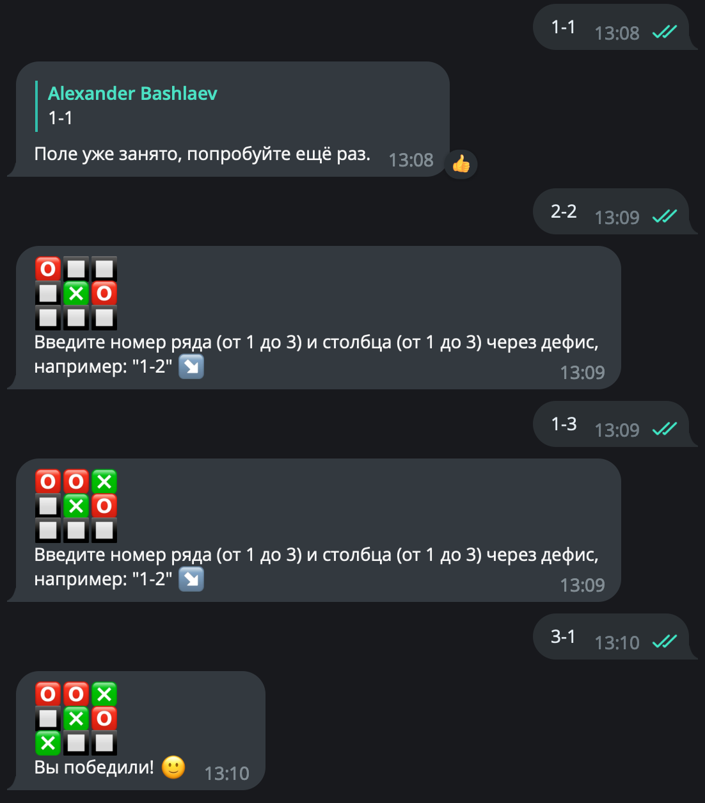

# [Простой телеграм-бот](https://t.me/pf_1122_bot)
## Калькулятор:


## Крестики-нолики:




## Детектор предметов одежды на фото

[DeepFashion2 json annotations](https://drive.google.com/file/d/1ADv8rePEUis8bp6gfR1l38nE6CSWghVj/view?usp=sharing)
```
mkdir ./DeepFashion2/
gdown --id 1ADv8rePEUis8bp6gfR1l38nE6CSWghVj  -O ./DeepFashion2/json.zip
unzip ./DeepFashion2/json.zip -d ./DeepFashion2/ > /dev/null
rm -f ./DeepFashion2/json.zip
```

[Trained model weights](https://drive.google.com/file/d/1yQLcr73AMfT0baNi0QxwN_A8qx92LzHo/view?usp=sharing)
```
gdown --id 1yQLcr73AMfT0baNi0QxwN_A8qx92LzHo -O ./model/model_0021999.pth
```

Примеры:


